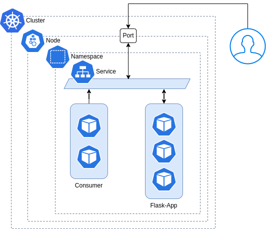

# example-flask-k8s



Este ejemplo crea una API basica de `flask`, con un consumidor que accede desde el service a la API. Para exponer 
la API se creó un servicio tipo NodePort el cual expone un puerto en todos los nodos para que la API sea accesible 
desde fuera del cluster y por el consumer desde el nodo.

**Requisitos**

- Cluster de k8s (minikube o docker-desktop)
- Docker
- kubectl
- Make

Build las imagenes del API y el Consumer

```shell
make build-flask-app
make build-consumer
```
> Para que el cluster de k8s haga pull de las images en local se usa el parámetro `imagePullPolicy` en `Never` asi 
> evitamos que intente accder a internet a buscar las imagenes y las busque en local


Aplicar los deployments

```shell
kubectl apply -f ./manifest/deployments/flask-app.yaml \
    -f ./manifest/deployments/consumer.yaml \
    -f ./manifest/services/flask-app.yaml
```

Borrar todo

```shell
kubectl delete -f ./manifest/deployments/flask-app.yaml \
    -f ./manifest/deployments/consumer.yaml \
    -f ./manifest/services/flask-app.yaml
```
